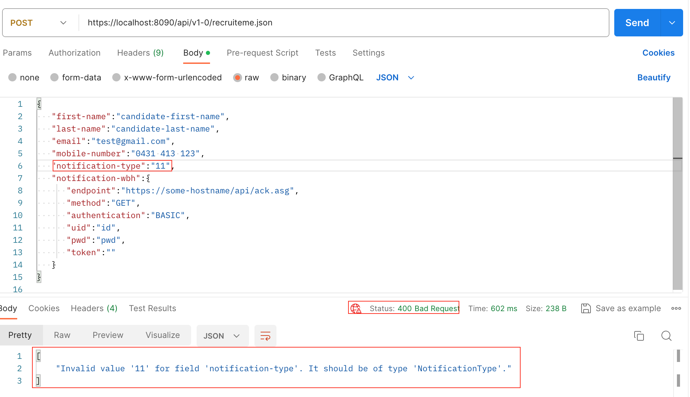
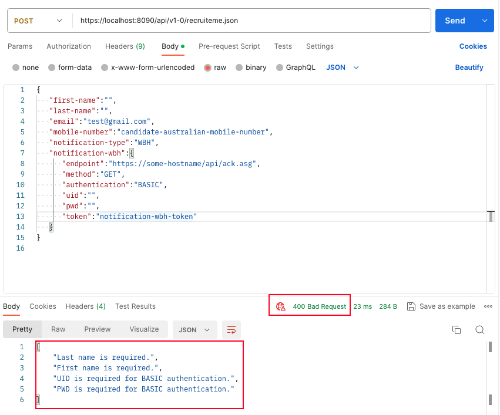
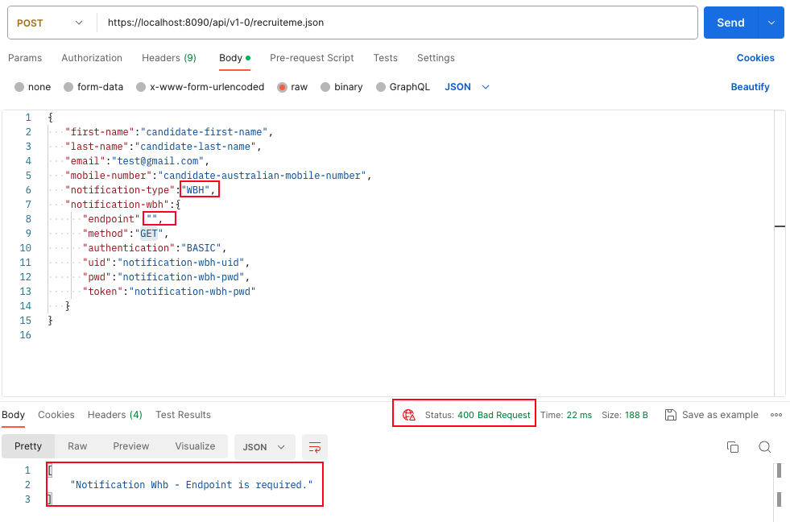
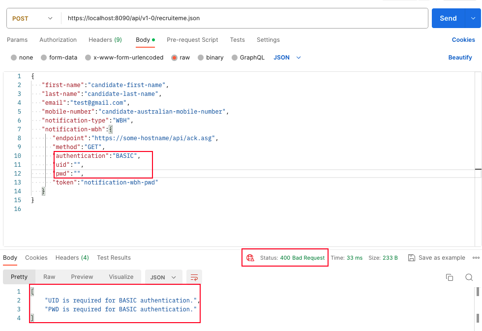
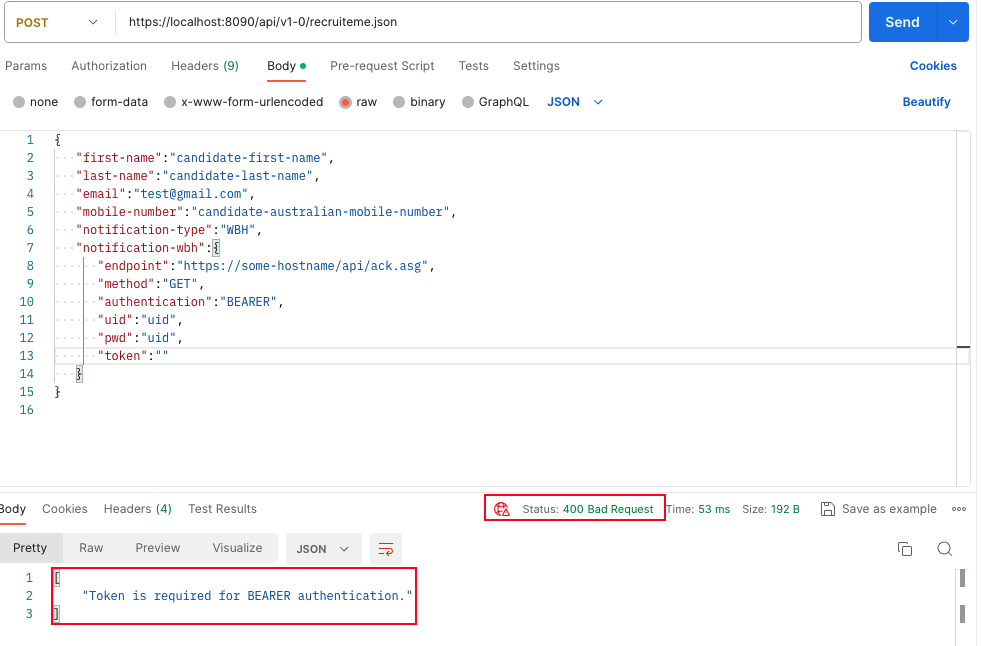
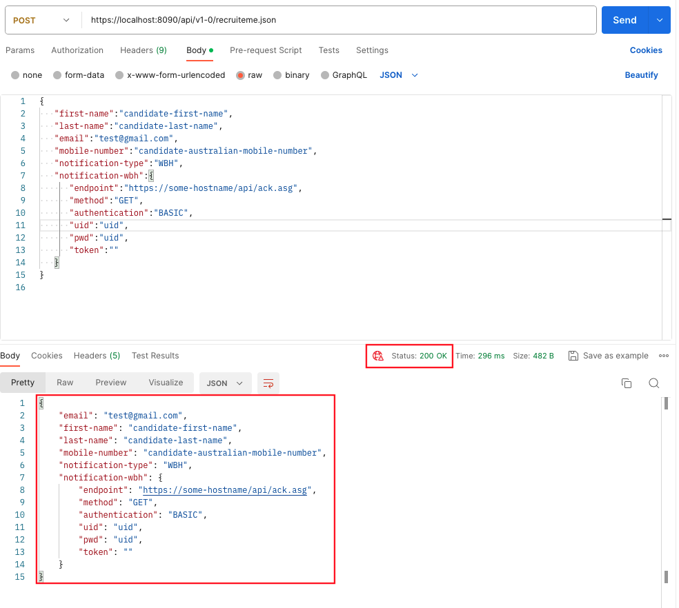
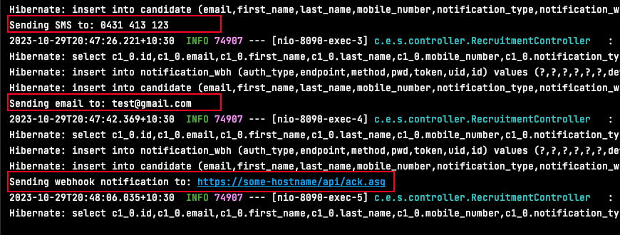

# Simply Recruit Me API 

## Before Start
This application was tested by Postman.

## Configuration
* JDK: JDK 17
* Framework: Spring boot 3.1.5
* Build Tool: Maven 3.8.4

## Getting Started
To run the application, execute:
`mvn spring-boot:run`

After starting, access the application at:
- API Endpoint: https://localhost:8090
- Database Console: https://localhost:8090/h2-console/

## Features
#### 1. POST API
| Feature          | Restful URI                | Method |
|------------------|----------------------------|--------|
| Candidate Create | /api/v1-0/recruiteme.json  | POST   |

#### 2. Notification mechanism
Based on the notification type:
- MBL: Email is sent to the candidate's email address.
- EML: SMS is dispatched to the candidate's mobile number.
- WBH: A webhook notification is dispatched to the specified endpoint.

## Assumptions & Explanations
#### 1. Overview  
When you send a POST request with the following payload, a new record is created in the CANDIDATE and NOTIFICATION_WBH tables:
Assumptions: 
- Post request endpoint: https://localhost:8090/api/v1-0/recruiteme.json
  ```json
  //sample payload 
  {
     "first-name":"candidate-first-name",
     "last-name":"candidate-last-name",
     "email":"test@gmail.com",
     "mobile-number":"candidate-australian-mobile-number",
     "notification-type":"MBL",
     "notification-wbh":{
         "endpoint":"https://some-hostname/api/ack.asg",
         "method":"GET",
         "authentication":"BASIC",
         "uid":"notification-wbh-uid",
         "pwd":"notification-wbh-pwd",
         "token":"notification-wbh-pwd"
     }
  }
Upon successful request processing:
- MBL: Email is sent to the candidate's email address.
- EML: SMS is dispatched to the candidate's mobile number.
- WBH: A webhook notification is dispatched to the specified endpoint.

#### 2. Test case
- Test case 1) Type error check
    - For invalid values in notification-type(_**MBL/EML/WBH**_), method(**_POST/GET_**), or authentication(**_NOAUTH/BASIC/BEARER_**), a 400 Bad Request response is returned with relevant error messages.
    - Assumption: All types are case sensitive
    - Example result screen:
  
     
- Test case 2) Missing Mandatory Columns
  - If a mandatory column is missing, a 400 Bad Request response is returned.
  - Example result screen:
  
     
- Test Case 3) WBH validator
  - For notification-type set as _**WBH**_, if mandatory columns are missing, a 400 Bad Request response is returned.
  - Example result screen:
  
   
- Test Case 4) Notification WBH validator 
  - For notification-wbh.authentication set as _**BASIC**_ and either uid or pwd is missing, a 400 Bad Request response is returned.
  - Example result screen:
  

  - For notification-wbh.authentication set as **_BEARER_** and token is missing, a 400 Bad Request response is returned.
  - Example result screen:
  

- Test Case 5) Successful creation
  - If all requirements are satisfied, the API will return the saved object from the DB along with a 200 OK response status and will subsequently trigger the notification mechanism.
  - Example result screen:
  
  - Example result screen for Notification mechanism
  
     
#### 3. Additional Notes  
Unit tests have been added. Refer to the test directory for detailed test cases.

## Contact Information
For any inquiries or feedback, reach out to:
Ria Yu (urosaria0720@gmail.com)
